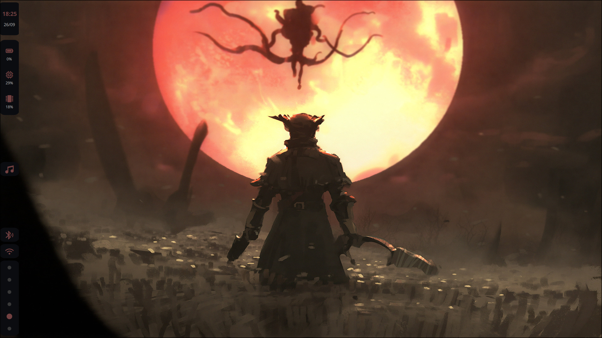
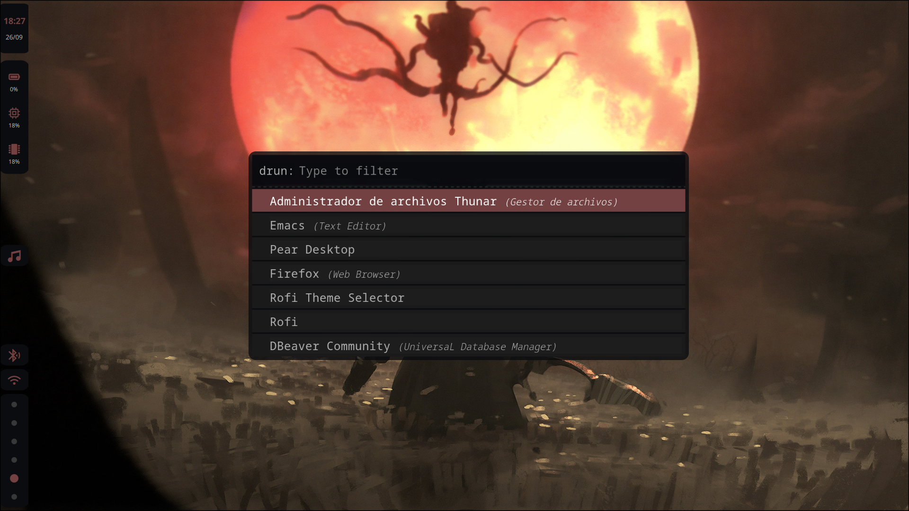
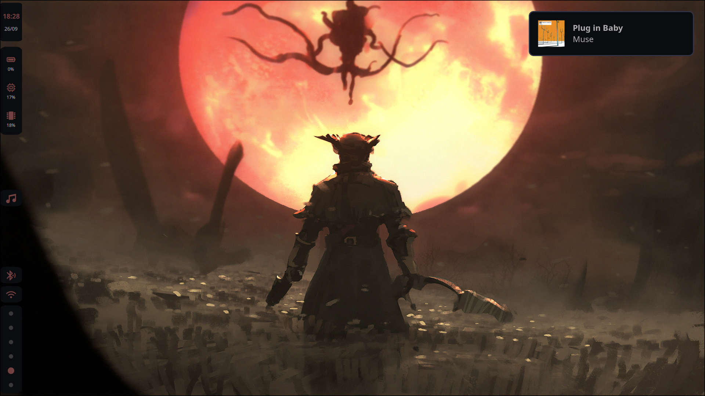
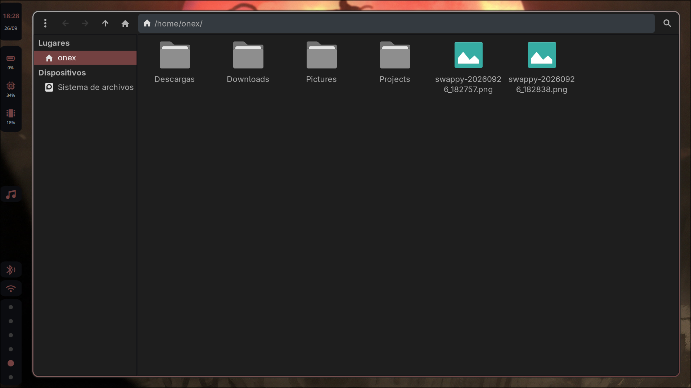

# Wayland Desktop Dotfiles

My **Wayland** desktop setup built on **Hyprland** (configured in Lua), with a sidebar written in **Quickshell** and a dark palette with crimson accents applied across the whole system: notifications, launcher and GTK apps.



## Contents

| Path | Program | Purpose |
|---|---|---|
| `.config/hypr/hyprland.lua` | [Hyprland](https://hypr.land) | Tiling window manager: keybinds, autostart, look and keyboard |
| `.config/hypr/hyprpaper.conf` | hyprpaper | Rotating wallpapers |
| `.config/quickshell/` | [Quickshell](https://quickshell.org) | Vertical sidebar with widgets |
| `.config/mako/config` | mako | Notifications |
| `.config/rofi/config.rasi` | rofi | App launcher and clipboard menu |
| `.config/gtk-3.0/` | GTK 3 | Dark theme, Papirus-Dark icons and Thunar styling |

## Sidebar (Quickshell)

A 40 px vertical bar anchored to the left edge (`shell.qml`). Each widget lives in `quickshell/mainbar/` and the shared colors are in `Colors.qml`.

**Top**
- **Clock**: time (`hh:mm`) and date (`dd/MM`).
- **SystemInfo**: battery (`BAT0`), CPU load (from `/proc/loadavg`) and RAM usage.

**Center**
- **Pear**: music controls for [Pear Desktop](https://github.com/pear-devs/pear-desktop) (YouTube Music) through `playerctl`. It shows the title and artist and has previous, play/pause and next buttons. It only appears while something is playing or paused.

**Bottom**
- **Bluetooth**: state (off / on / connected) and device name. Clicking it opens `bluetoothctl` in `foot`.
- **Network**: connection type (LAN / Wi-Fi) and network name. Clicking it opens `nmtui`.
- **Workspaces**: workspaces 1–6 with the active one highlighted. Clicking one switches to it.

### Palette

| Use | Color |
|---|---|
| Main background | `#0b0c10` |
| Modules | `#343a40` |
| Borders | `#495057` |
| Accent (crimson) | `#734141` |
| Text | `#B0B0B0` |

## Hyprland

- **Programs:** `foot` terminal, `thunar` file manager and `rofi` / `hyprlauncher` launchers.
- **Autostart:** hyprpaper, mako, quickshell, hyprpolkitagent and cliphist (text and image history).
- **Look:** `gaps_in = 5`, `gaps_out = 20`, 2 px borders and 10 px rounded corners.
- **Keyboard:** `es` layout.

### Main keybinds (`SUPER` = Windows key)

| Keybind | Action |
|---|---|
| `SUPER + Enter` | Terminal (foot) |
| `SUPER + D` | App launcher (rofi) |
| `SUPER + R` | hyprlauncher |
| `SUPER + E` | File manager (Thunar) |
| `SUPER + V` | Clipboard history (cliphist + rofi) |
| `SUPER + C` | Close window |
| `SUPER + M` | Exit Hyprland |
| `SUPER + P` | Pseudo-tiling |
| `SUPER + J` | Toggle split direction (dwindle) |
| `SUPER + arrows` | Move focus between windows |
| `SUPER + 1…0` | Go to workspace |
| `SUPER + SHIFT + 1…0` | Move window to workspace |
| `SUPER + S` / `SUPER + SHIFT + S` | Show the special workspace / move a window to it |
| `SUPER + mouse wheel` | Cycle through workspaces |
| `SUPER + left click` | Drag window |
| `Print` | Region screenshot (grim + slurp + swappy) |

## Launcher (rofi)

A semi-transparent dark theme with a crimson selection. It's used as the app launcher (`drun`) and as the clipboard history menu.



## Notifications (mako)

Notifications appear in the top-right corner with the same background and text color as the bar, and last 5 seconds. Urgent ones get a red border and stay on screen until dismissed. Messaging and music notifications get a green border.



## GTK / Thunar

Dark theme preferred, **Papirus-Dark** icons, and a `gtk.css` that fits Thunar to the palette: `#1E1E1E` background and crimson selection.



## Wallpapers (hyprpaper)

hyprpaper picks images from `~/Pictures/wallpapers` and changes the wallpaper every 30 minutes on the `eDP-1` monitor. The wallpaper in the screenshots is `images/bloodborne1.jpg`.

## Dependencies

```
hyprland hyprpaper hyprpolkitagent hyprlauncher quickshell mako rofi foot thunar
playerctl bluez-utils networkmanager wl-clipboard cliphist grim slurp swappy
papirus-icon-theme ttf-jetbrains-mono-nerd
```

## Installation

```bash
git clone <repo-url> ~/WaylandDesktopDotfiles
cp -r ~/WaylandDesktopDotfiles/.config/* ~/.config/
mkdir -p ~/Pictures/wallpapers && cp ~/WaylandDesktopDotfiles/images/bloodborne1.jpg ~/Pictures/wallpapers/
```

> Back up your `~/.config` before copying. If you use a different monitor, change `monitor = eDP-1` in `hyprpaper.conf`. If your battery isn't `BAT0`, update the path in `SystemInfo.qml`.
